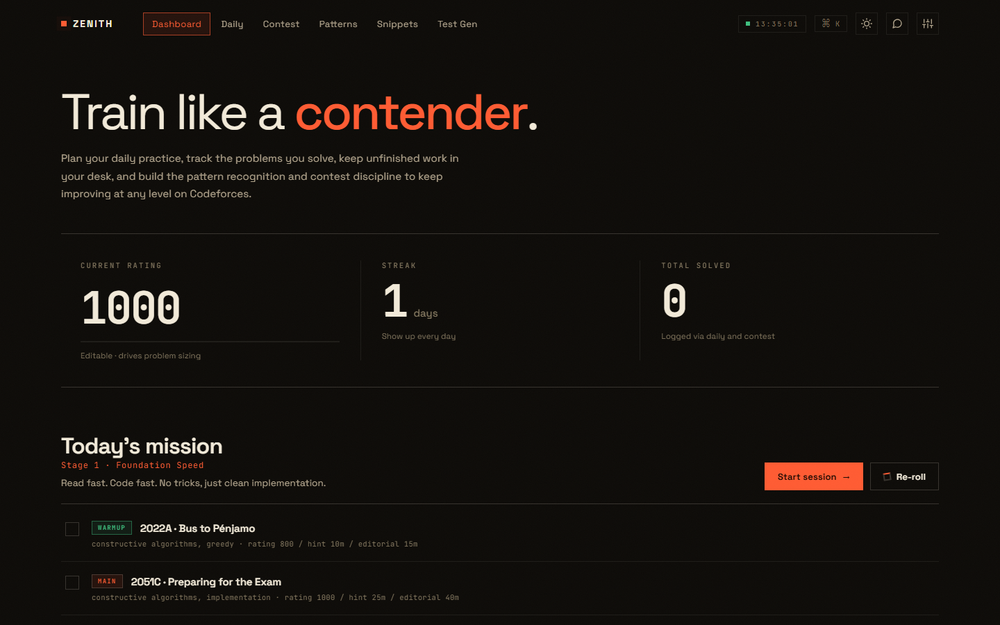

# ZENITH · Practice Workspace


A Codeforces practice workspace that runs entirely in your browser. One HTML file, no installation, no backend, no account. All progress stays on your device.

Open the app, set your rating, and get today's mission: a problem set sized to your level, with a session timer and per-problem hint/editorial budgets.



## Table of contents

- [Features](#features)
- [Installation](#installation)
- [Usage](#usage)
- [Privacy](#privacy)
- [Tech stack](#tech-stack)
- [Contributing](#contributing)
- [Feedback and issues](#feedback-and-issues)
- [License](#license)

## Features

- **Daily training** — pulls problems live from the Codeforces problem set, sized to your rating (warmup / main / stretch bands). Generate sets at random, filtered by tags, or with exact per-problem rating targets. Run a session timer and respect each problem's hint and editorial budget.
- **Contest simulator** — run a Codeforces-style contest with your own duration (30–360 min) and problem count (1–12), track each slot as tried or solved, then log a post-contest analysis of where the time went and which trigger you missed.
- **Pattern library** — capture the trigger signals and core ideas of the patterns you keep missing, tag them, and browse or search them later.
- **Code snippets** — a searchable, language-tagged vault of reusable templates (C++, Python, Java, JavaScript, or any custom language).
- **Test case generator** — generate arrays, strings, pairs, matrices, graphs, trees, permutations, and more, from a form or a small custom DSL, with seeds and multi-case output for reproducible tests.
- **Currently solving desk** — park problems you're mid-way through and pick them back up later.
- **Progress tracking** — streak, total solved, and per-problem history, saved locally.
- **Extras** — light/dark themes, a command palette (`Ctrl/Cmd+K`), import/export backup, and a built-in feedback form that opens a pre-filled GitHub issue.

## Installation

No build tools, no package manager, no server. You only need a modern web browser (Chrome, Firefox, Edge, or Safari).

### Option 1: Download the release

1. Go to the [Releases](https://github.com/Madacool01/ZENITH/releases) page and download the latest `.zip`.
2. Extract it anywhere on your computer.
3. Open the extracted folder and double-click `oi-os-v2.html`.
4. The app opens in your default browser. You're done.

### Option 2: Clone with Git

```bash
git clone https://github.com/Madacool01/ZENITH.git
cd ZENITH
```

Then open `oi-os-v2.html` in your browser. On most systems you can do this from the command line:

```bash
# macOS
open oi-os-v2.html

# Windows (Command Prompt)
start oi-os-v2.html

# Linux
xdg-open oi-os-v2.html
```

Or just find the file in your file explorer and double-click it.

### Option 3: Download the ZIP from GitHub

1. Click the green **Code** button at the top of this repository.
2. Select **Download ZIP**.
3. Extract the ZIP file.
4. Double-click `oi-os-v2.html`.

### What you need

Make sure these three items stay together in the same folder, since the app expects them at fixed relative paths:

- `oi-os-v2.html` — the app itself
- `finish-alarm.mp3` — session-end sound
- `icon/` — the icon assets folder

There's nothing to install and nothing to configure. No Node, no Python, no dependencies.

## Usage

1. Open `oi-os-v2.html`.
2. Set your current Codeforces rating on the dashboard.
3. Start a session, or jump into the contest simulator, pattern library, or snippet vault from the navigation bar at the top.
4. Your progress autosaves as you go.

## Privacy

- No backend, no accounts, no telemetry. Everything is stored in your browser's `localStorage`.
- The only network request is to the [Codeforces API](https://codeforces.com/apiHelp) to load the live problem pool. If you're offline or Codeforces is unreachable, the app falls back to a built-in curated problem list, so it keeps working either way.
- Google Fonts are loaded from the web; if they're blocked, the app falls back to system fonts.
- Export a JSON backup anytime from **Settings → Data** and restore it on another device.

## Tech stack

- Single-file web app: HTML, CSS, and vanilla JavaScript. No frameworks, no build step.
- Data: browser `localStorage`, with a separate cache for the Codeforces problem pool.
- Problem pool: [Codeforces API](https://codeforces.com/apiHelp) (`problemset.problems`), refreshed automatically once per day.

## Contributing

Contributions are welcome.

1. Fork the repository.
2. Create a branch for your change: `git checkout -b feature/my-change`.
3. Make your changes to `oi-os-v2.html`.
4. Test by opening the file directly in a browser.
5. Commit and push, then open a pull request describing what changed and why.

Since this is a single-file app, keep changes focused and avoid introducing a build step unless there's a strong reason for it.

## Feedback and issues

Use the feedback button in the app's masthead to open a pre-filled GitHub issue. Bug reports and feature requests are both welcome, and you can also [open an issue directly](https://github.com/Madacool01/ZENITH/issues) if you'd rather skip the app.

## License

Released under the [MIT License](LICENSE).
